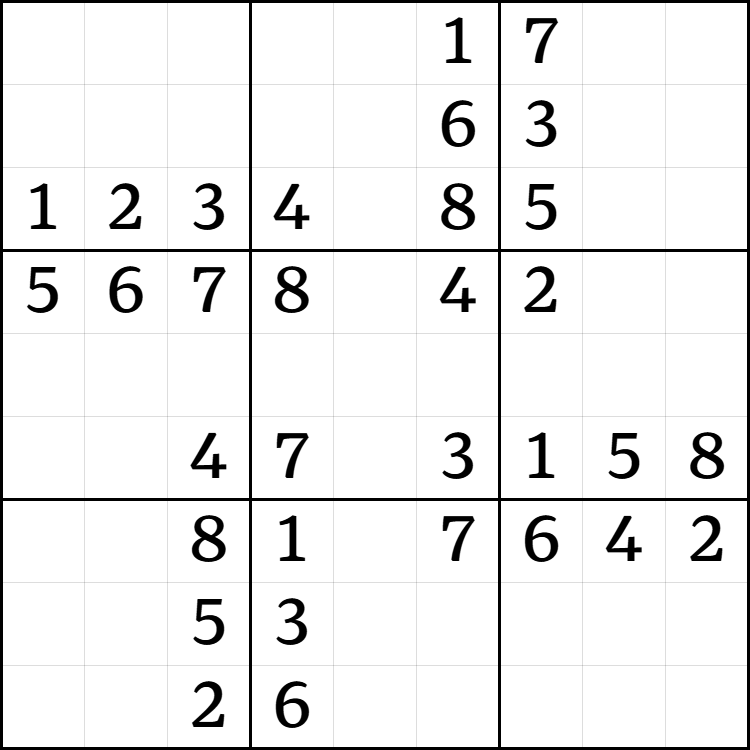
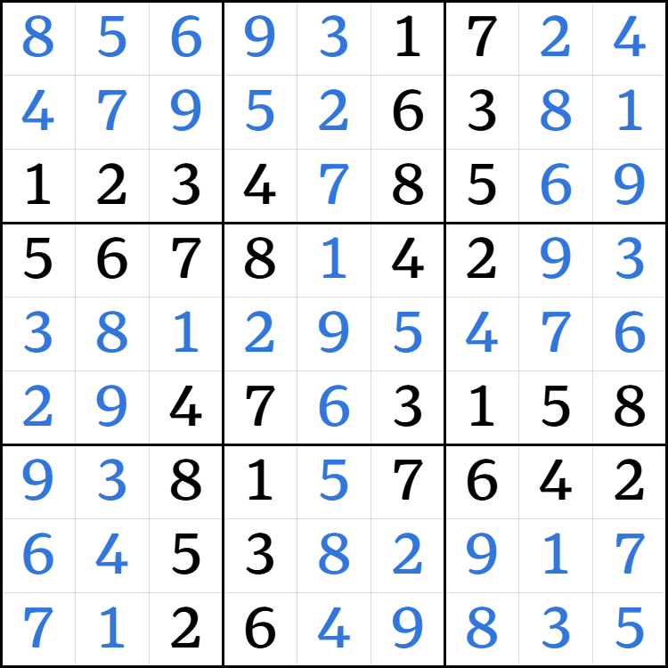
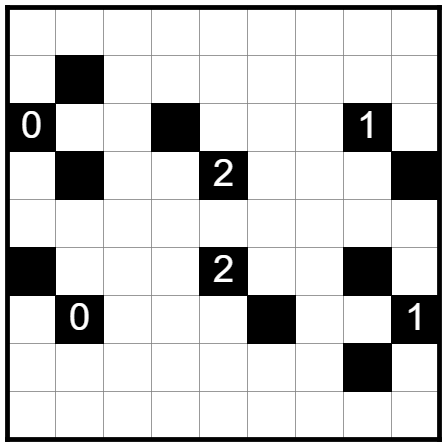
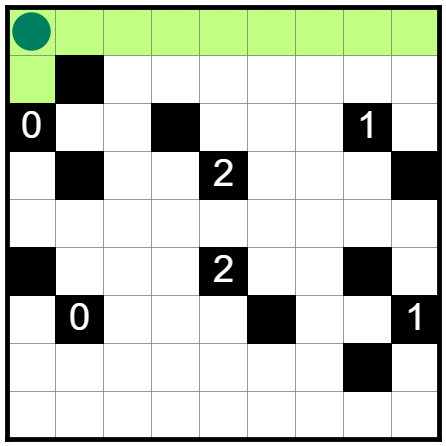
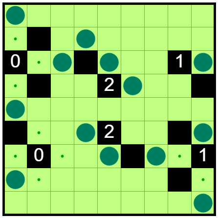

# Puzzpals

Puzzpals is an ongoing graduation project by me and my friends. It’s a website where you can solve Nikoli-style logic puzzles with your friends.

## Progress

I’m focusing on security patches on the server. Once the server is secure, we’ll make the website available and invite people to test it. I’ll put the website link here.

At first, Akari will be the only puzzle type available. We’re considering ways to support dozens of puzzle types without explicitly coding each of them.

## Nikoli-style puzzles

Have you ever solved a Sudoku? You’re given a grid divided into boxes. Some of the grid has been filled in with numbers. Your goal is to fill in the rest of the grid with numbers 1-9 so that numbers in the same row don’t repeat, as well as numbers in the same column, and numbers in the same box.

Here’s a Sudoku (Sudoku B2/A2 from the [2025 MIT Logic Puzzle Open](https://puzzles.mit.edu/logicopen/2025/index.html)). An interactive Sudoku is available in [sudoku.coach](https://sudoku.coach/en/play/000001700000006300123408500567804200000000000004703158008107642005300000002600000).

::: details Solution

:::

Sudoku blew up in popularity when the Japanese publisher Nikoli started making them. However, Nikoli made many more types of puzzles.

Here’s a common type: Akari, also known as Light Up. You’re given a grid that you need to light up using light bulbs. Bulbs shine in four directions: left, right, up, and down. Some cells are black, which block light. Additionally, black cells with numbers indicate how many bulbs are _orthogonally adjacent_ to them. This means bulbs above, below, to the left, and to the right. Finally, bulbs may not shine on each other.

Here’s an Akari puzzle (Akari B1/A1 from the 2025 MIT Logic Puzzle Open). An interactive Akari is available in [puzz.link](https://puzz.link/p?akari/9/9/p.ma.ib.hcg.o.ic.hag.hbk.p).

::: details Don't know where to start?
Look at the cell above the top-left 0. That cell can't have a light bulb because a 0 is next to it. The only way it could be lit up is to place a bulb above it.

Try using the same trick for the other two cells next to the 0.
:::

::: details Solution

:::

In general, Nikoli publishes puzzles that are grid-based and logic-based. You’re given a grid with some symbols, and you’re told what rules the solution obeys. From there, you need to deduce the solution via logic. This involves keeping track of possible states (”This cell could be 3 or 6”) and eliminating those that would lead to rule violations.

Inspired by Nikoli, puzzle setters have invented [many puzzle types](https://puzz.link/list.html) that follow a similar style. These Nikoli-style puzzles are the subject of our project. Other stuff is out of scope:

- Chess, checkers, and other board games. Although they’re multiplayer and played on a grid, they don’t involve deducing a solution that satisfies all the rules.
- Chess puzzles. They involve deduction, but the rules are implicit rules in chess about which positions are advantageous. This sets chess puzzles apart from Nikoli-style logic puzzles, which have explicit rules.
- “Einstein puzzles”. You may find them if you search “logic puzzle” on Wikipedia. They contain statements like “A person living next to the orange house has a cat.” The goal is to deduce who lives in which house, owns which pet, etc. Einstein puzzles are often solved using a grid, and they involve deducing a solution that satisfies every statement, so they’re similar to Nikoli-style puzzles. However, Nikoli-style puzzles emphasise communication using symbols instead of words. Once you learn the rules, you could look at a grid and understand the puzzle. This isn’t the case for Einstein puzzles.

## The idea

We usually solve puzzles alone. However, puzzle communities have organised many events called “puzzle hunts” or “puzzlehunts” where teams collaborate on solving puzzles.

A puzzlehunt consists of many puzzles. The goal of a puzzle is usually to obtain an English phrase from it, but solvers need to figure out how to do it — the puzzle won’t tell you. The goal of a puzzlehunt is usually to solve the final puzzle, which uses the answers of other puzzles as its clues. Note that puzzlehunt puzzles are not identical to Nikoli-style puzzles.

Puzzle topics can be very diverse. Pop culture, niches, music, books, sports, video games, memes, foreign languages, artificial languages, math, science, programming. You name it, and maybe there’s a puzzle about it. Solvers will be experts in some topics and ignorant in others, love some puzzles and dread others. Puzzlehunts are often more fun when played in teams, so that you can specialise on your favourite puzzles. In addition, the amount of content in a puzzlehunt is often tailored to teams instead of individuals. Puzzlehunts have a time limit during which participants may ask the organisers for hints, and after which puzzle answers will be revealed. Popular puzzlehunts like the Galactic Puzzle Hunt usually require teams of 3-6 to finish. Hence, puzzlehunts are multiplayer in nature.

Nikoli-style puzzles are naturally a hot topic in puzzlehunts. Puzzlehunt puzzles of this topic usually appear as standard Nikoli-style puzzles but contain a twist that solvers need to figure out. For example, solvers may realise that the puzzle is _under-constrained_ — there aren’t enough clues to deduce the answer — and look for hidden constraints.

Teams often copy puzzles to Google Sheets to organise information and collaborate. This is so widespread that recent puzzlehunts often offer a “copy to clipboard” button in each puzzle for pretty pasting in Google Sheets. If you copy and paste the puzzle without using the button, it would appear line-by-line instead of in tabular format.

If you tried solving the Sudoku and Akari in interactive websites, you’d have experienced the intuitive controls they bring: Drag to select multiple cells, click to add a light bulb, etc. Google Sheets, as a spreadsheet software, lacks these controls. This is what Puzzpals tries to address. Think of Puzzpals as a collaborative editor for puzzles.

Another inspiration for Puzzpals came from [Sudokuvania: Digits of Despair](https://sudokupad.app/6u61fsw0di?setting-nogrid=1&setting-largepuzzle=1), a difficult puzzle consisting of many Sudokus with modified rules. When I visited [my friend](https://blog.buckbc.com/) during my exchange to Edinburgh, he would sometimes be racking his brain over the puzzle. It was fun to stare at the puzzle hoping to find directions and share them with him. Difficult puzzles like Sudokuvania can take hours to solve alone, making them suitable for team solving — easier puzzles don’t really need team effort.
